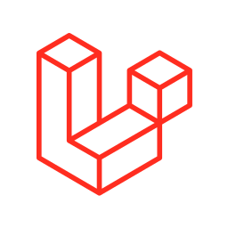

### Hi there 👋

Welcome to my GitHub profile. I'm Amar Eldjalil, a computer science Engineer (student) . 

## Technologies I Use

- **Programming Languages:**
  

- **AI:**
  

- **Backend:**

- **Frontend:**
  

- **Database:**

- **DevOps:**

## Tryhackme

 

## Connect with Me

## GitHub Stats

<!--
**Bkz-Amar/Bkz-Amar** is a ✨ _special_ ✨ repository because its `README.md` (this file) appears on your GitHub profile.
Here are some ideas to get you started:
<!--
- 🔭 I’m currently working on ...
- 🌱 I’m currently learning ...
- 👯 I’m looking to collaborate on ...
- 🤔 I’m looking for help with ...
- 💬 Ask me about ...
- 📫 How to reach me: amarbouakaz91
- 😄 Pronouns: ...
- ⚡ Fun fact: ...
-->

